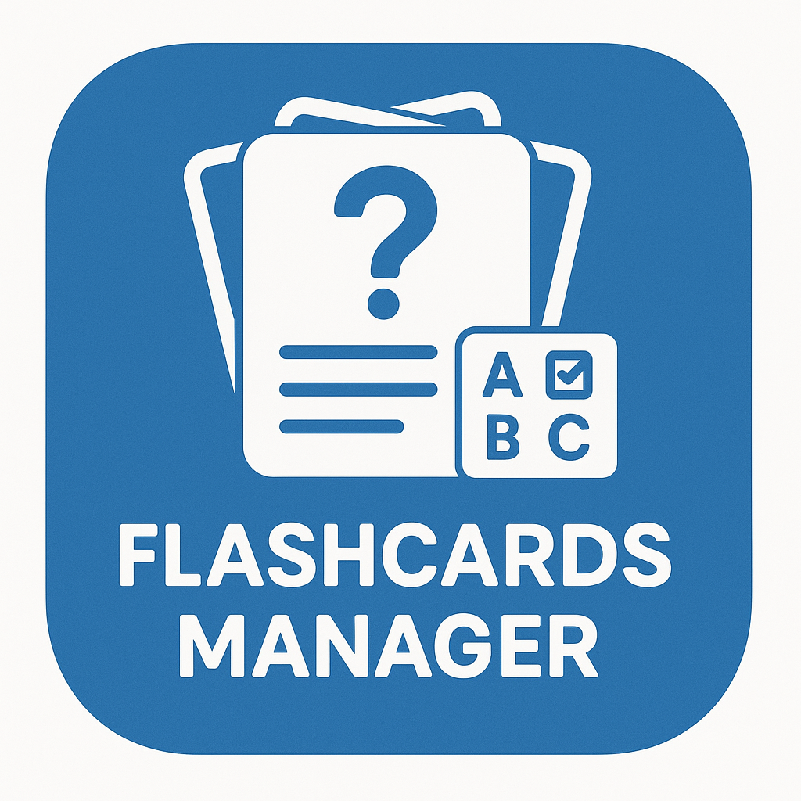

# Flashcard Manager

Flashcard Manager è un sito web progettato per aiutarti a studiare in modo più efficace tramite la creazione di flashcard personalizzate e test su misura. Grazie a funzionalità avanzate, puoi organizzare il tuo apprendimento in base a materie e argomenti specifici.

## Funzionalità principali

- **Creazione di Flashcard Personalizzate**  
  Crea, modifica e organizza le tue flashcard secondo le tue esigenze di studio.

- **Test Personalizzati**  
  Genera test mirati scegliendo argomenti e materie, per verificare le tue conoscenze in modo efficace.

- **Daily Study & Spaced Repetition**  
  Utilizza la funzione "Daily Study", configurabile secondo le tue preferenze, che applica il metodo di studio della *spaced repetition*. Il sistema programma automaticamente i tuoi ripassi, suddividendoli nei giorni più adatti per massimizzare la memorizzazione a lungo termine.

## Main interface

## Come iniziare

1. **Aggiungi le tue flashcard** scegliendo materia e argomento.
2. **Configura la funzione Daily Study** per massimizzare secondo le tue preferenze l'apprendimento.
3. **Svolgi i test personalizzati** per monitorare i tuoi progressi.

## Tecnologie utilizzate

- Frontend: AngularIo + material + bootstrap
- Backend: Typescript + NodeJs + NestJs
- Database: MongoDB

E' facilmente portatile come container Docker

## Contribuire

Se vuoi contribuire al progetto, apri una issue o invia una pull request!

## Licenza

Questo progetto è distribuito sotto licenza MIT.
